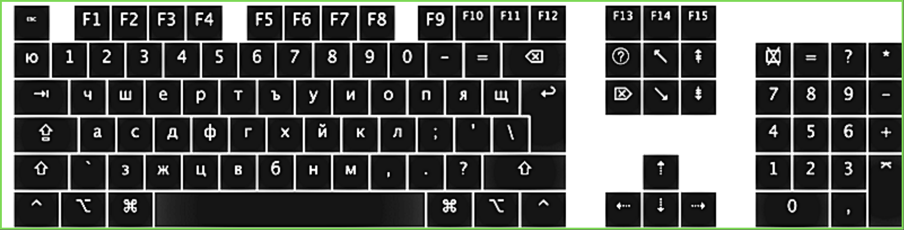

# Bulgarian Phonetic Keyboard Layout for macOS

## Introduction

This repository is dedicated to the Bulgarian Traditional Phonetic Keyboard layout for macOS, designed to simplify typing in Bulgarian by aligning Cyrillic letters to keyboard keys based on their phonetic sound.

Tested in the latest MacOS version: **macOS 14 Sonoma**

## Installation on macOS

1. **Download the Layout File**
 
   Download the `KV-BG-Phonetic.keylayout` file.

2. **Install the Keyboard Layout**

   Copy the downloaded file to the `~/Library/Keyboard Layouts/` directory.

3. **Restart Your Mac**

   Restart your computer to ensure the new keyboard layout is recognized by the system.

4. **Activate the Layout**

   - Open `System Preferences > Keyboard > Input Sources`.
   - Click the `+` button and navigate to the "Others" section at the bottom of the list.
   - Look for **BG - Phonetic** and click "Add" to select it as one of your input methods.

## Usage

After restarting your Mac and adding the keyboard layout, select **BG - Phonetic** from the input source options in your system menu bar to start using it.

## Developer Support:

- If you saw some issue/bug 🐛
- If you want some new feature or change to be added/implemented. 😊

Please, contact the creator of **Bulgarian Phonetic Keyboard**, so he will be able to fix or improve it:

[Kristiyan Velkov](https://www.linkedin.com/in/kristiyan-velkov-763130b3/)

## Support my work

If you like my work and want to support me to work hard, please donate via:

[Revolut](https://revolut.me/kristiyanvelkov) OR [Buy me a coffee](https://www.buymeacoffee.com/kristiyanVelkov)  
Thanks a bunch for supporting me! It means a LOT 😍

## Contributing

Contributions are welcome. Feel free to submit pull requests or open issues for suggestions, improvements, or bug reports.

## Author

[Kristiyan Velkov](https://www.linkedin.com/in/kristiyan-velkov-763130b3/)

## License

Released under the [MIT License](LICENSE). See the LICENSE file for more details.
